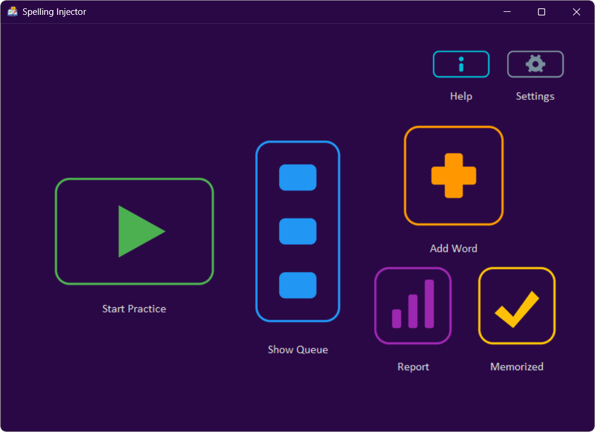

# Spelling-Injector

A standalone desktop application designed for learning and mastering English vocabulary and spelling through interactive practice. Built with `tkinter` for a user-friendly interface, this tool leverages Excel files for word management and integrates Text-to-Speech (TTS) for pronunciation, offering a simple yet effective way to enhance spelling skills.

## Introduction
Mastering English vocabulary requires consistent practice and active recall. This application is tailored specifically for individuals looking for a simple, concise, and highly focused tool dedicated entirely to practicing English spelling. It systematically tests users on their personalized word lists, utilizing audio cues to simulate real dictation, and automatically tracks their progress until words are fully memorized.

> *"The first public release (v1.0.0) is the result of major internal iterations, extensive local testing, and continuous refinement before being open-sourced."*

## Features

- **Targeted Spelling Assistance (Highlighting Weak Spots):** Prepare your vocabulary in an Excel file (like `new.xlsx`) and simply **bold** the specific parts of any word you struggle to spell. The application smartly detects this and heavily bolds those exact letters during your practice sessions. This visual emphasis helps draw your attention to your weak spots, making it much easier to memorize difficult spellings.
- **Smart Vocabulary Management:** Easily import your word lists via standard Excel files. The app automatically tracks your progress and seamlessly moves words you've successfully learned into a separate "memorized" list, keeping your daily practice focused and efficient.
- **Advanced Audio Dictation:** Listen to clear, precise pronunciations of your vocabulary. You can switch between US and UK accents, adjust the reading speed (slow, normal, or fast) to match your listening level, and even continue practicing offline without needing an internet connection.
- **Customizable Learning Goals:** Tailor the difficulty to your personal needs. You can easily adjust how many times you need to type a word correctly before it is officially considered "memorized" directly from the application's settings (the default is set to 5 successful attempts).
- **Dynamic & Beautiful Interface:** Personalize your learning environment with a built-in color picker featuring dozens of themes. The app automatically adjusts text colors so they are always readable against your chosen background, and offers a modern, sleek design that integrates perfectly with your system.
- **Safe & Portable:** Your learning progress is always safe thanks to an automatic background backup system that prevents accidental data loss. Plus, the app is completely portable—no complex installation is required; just run it and start practicing.

## Download & Run (End Users)

To use the application on Windows:

1. Navigate to the [Releases page](https://github.com/HojjatSabzali/Spelling-Injector/releases/latest) of this repository.
2. Download the `Spelling-Injector-Windows.zip` archive.
3. Extract the ZIP file to a local directory.
4. Open the `Spelling Injector.exe` file to launch the application.

## Building from Source (Developers)

### Prerequisites
- **Python 3.12** (Strictly required to function and compile correctly).
- **C Compiler** (MinGW-w64 is highly recommended for Windows compilation using Nuitka).
- **Git** (For cloning the repository).

### Setup Instructions
1. Clone this repository:
~~~bash
git clone https://github.com/HojjatSabzali/Spelling-Injector.git
cd Spelling-Injector
~~~

2. (Optional but recommended) Create and activate a virtual environment:
~~~bash
python -m venv venv
venv\Scripts\activate
~~~

3. Install the required Python packages:
~~~bash
pip install -r requirements.txt
~~~

### Running from Source
To execute the raw Python script, run the following command:
~~~bash
python "main.py"
~~~

### Automated Build (Compilation)
To compile the raw Python script into a standalone `.exe` file without a background console, simply execute the included batch script. This script automatically cleans previous builds, compiles the code using Nuitka, includes the necessary asset directories (like `icons`), and packages everything into a ready-to-release ZIP file.
~~~cmd
build.bat
~~~

## Author's Note on Development Methodology
In the spirit of full transparency, please note that the core Python codebase of this application was generated using **Gemini 3.1 Pro**. My primary role in this project was focused on high-level system design, logic orchestration via detailed prompting, and rigorous debugging during the execution phases.

## License

Copyright © 2026 Hojjat Sabzali

This project is open-source and available under the MIT License.

## Contact

- **Email:** [sabzali.hojjat@gmail.com](mailto:sabzali.hojjat@gmail.com)
- **LinkedIn:** [https://www.linkedin.com/in/hojjat-sabzali](https://www.linkedin.com/in/hojjat-sabzali)
- **GitHub:** [https://github.com/HojjatSabzali/](https://github.com/HojjatSabzali/)

Project Link: [https://github.com/HojjatSabzali/Spelling-Injector](https://github.com/HojjatSabzali/Spelling-Injector)
